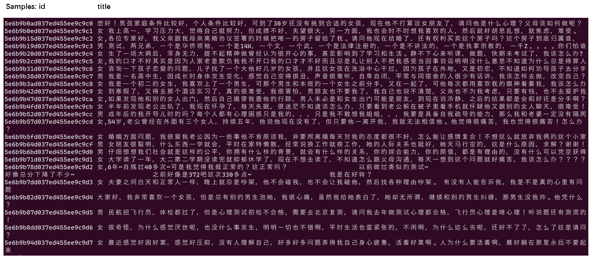

# Emotional First Aid Raw Dataset

让人工智能技术更好的服务于人类。
<div align=left>

&nbsp;&nbsp;&nbsp;&nbsp;&nbsp;&nbsp;&nbsp;&nbsp;&nbsp;&nbsp;&nbsp;&nbsp;&nbsp;&nbsp;&nbsp;&nbsp;&nbsp;&nbsp;&nbsp;&nbsp;&nbsp;&nbsp;&nbsp;&nbsp;&nbsp;&nbsp;&nbsp;&nbsp;&nbsp;&nbsp;&nbsp;&nbsp;&nbsp;&nbsp;&nbsp;&nbsp;&nbsp;&nbsp;&nbsp;&nbsp;&nbsp;&nbsp;&nbsp;&nbsp;&nbsp;&nbsp;&nbsp;&nbsp;&nbsp;&nbsp;&nbsp;&nbsp;&nbsp;&nbsp;&nbsp;&nbsp;&nbsp;&nbsp;&nbsp;&nbsp;&nbsp;&nbsp;-- Hai Liang W., [@hailiang-wang](https://github.com/hailiang-wang), [Chatopera](https://www.chatopera.com/) 
</div>

心理咨询问答原始语料库，仅限研究用途。

心理咨询问答原始语料库（以下也称为“本数据集”，“本语料库”）是为应用人工智能技术于心理咨询领域制作的高品质语料，语料是爬取心理咨询、心理健康领域公开的网站的数据，经过整理和脱敏制作而成。消息总文本达**四千四百多万字符**。

爬取开放数据网站，比如给\*心理、简\*心理、豆\*讨论组等。目前，一些网站已经关闭了数据的开放访问，使得本语料库更有宝贵价值。



## 数据格式

以下为每条的数据格式说明：

| 根节点 Key | 数组子元素 | 示例 | 描述 |
| --- | --- | --- | --- |
| title | - | `最近感觉好困好累，感觉好压抑` | 发布者发起的话题 |
| date | - | `2017-12-31 21:20:25` | 发布者发布的时间 |
| owner | - | `匿名` | 发布者昵称 |
| id | - | `5e6b9b94d037ed455ee9c9d7` | 唯一标识 ID |
| chats |  |  | 针对话题的交流，元素为 JSONArray，按照发生时间升序排列，即越靠近现在的 index 越大，越排在数组的后面，格式见下 |
| | sender | `audience` 或 `owner` | 发布者角色，`audience` 代表评论者，`owner` 代表发布者 |
| | name | `Audience1`, `Audience2` | 当 `sender` 为`audience`时存在，本评论发布者的名字（脱敏后） |
| | time | `21:20:44` | 发布的时刻 | 
| | value | `您好` | 评论内容 |

其中，每个话题都只有一个发布者 `owner`；数据进行了必要的脱敏，比如去掉了原始的爬取的 URL 地址、去掉了图片信息、重新生成了评论者的名称等。

## 数据示例

```
{
  "title": "女 最近感觉好困好累，感觉好压抑，没有人理解自己，好多好多问题弄得我自己身心疲惫，活着好累啊。人为什么要活着啊，最好躺在那里永远不要起来",
  "date": "2017-12-31 21:20:25",
  "owner": "匿名",
  "id": "5e6b9b94d037ed455ee9c9d7",
  "chats": [
    {
      "sender": "audience",
      "value": "您好！",
      "time": "21:20:44",
      "name": "Audience5"
    },
    {
      "sender": "audience",
      "value": "您今年多大了？这种好累的感觉有多久？",
      "time": "21:22:13",
      "name": "Audience3"
    },
    {
      "sender": "audience",
      "value": "你好，理解你的心情",
      "time": "21:27:07",
      "name": "Audience1"
    },
    {
      "sender": "audience",
      "value": "您好！发生了什么有影响的事件了吗？",
      "time": "21:28:51",
      "name": "Audience10"
    },
    {
      "time": "07:26:01",
      "sender": "owner",
      "value": "很多事情，老公的不理解，婆婆的无理取闹，大姑姐也闹，做的我身心疲惫"
    },
    {
      "time": "07:26:45",
      "sender": "owner",
      "value": "如果没有孩子这日子没法过了"
    },
    {
      "sender": "audience",
      "value": "请升级你的软件否则无法收到信息",
      "time": "08:13:41",
      "name": "Audience9"
    }
  ]
}
```

## 语料库规模

本语料库（[心理咨询问答原始语料库](https://github.com/chatopera/efaqa-corpus-raw)）的统计数据如下 -

话题数：172,316 （每个话题都带有评论）

消息总数：2,381,273 (话题+评论的消息总数)

消息文本规模：44,514,786 (全部话题和评论的文本字符的总计)

平均每个话题的评论数： 12.8 个

本语料也是[心理咨询问答语料库（Emotional First Aid Dataset，efaqa-corpus-zh）](https://github.com/chatopera/efaqa-corpus-zh)的语料来源：`心理咨询问答语料库`是在`心理咨询问答原始语料库`的基础上人工标记的结果，并且因为工作量巨大，仅完成了对部分原始语料的标记工作。

## 下载安装

安装和下载语料文件。

### 1/3 Install Sourcecodes Package

```bash
pip install -U efaqa-corpus-raw
```

### 2/3 Config license id

首先，从[证书商店](https://store.chatopera.com/product/efaqa002)购买的证书的【证书标识】，在证书商店，证书详情页，点击【复制证书标识】。


其次，设置环境变量。

* For Shell Users

e.g. Shell, CMD Scripts on Linux, Windows, macOS.

```bash
# Linux / macOS
export EFAQA_RAW_LICENSE=YOUR_LICENSE
## e.g. if your license id is `FOOBAR`, run `export EFAQA_RAW_LICENSE=FOOBAR`

# Windows
## 1/2 Command Prompt
set EFAQA_RAW_LICENSE=YOUR_LICENSE
## 2/2 PowerShell
$env:EFAQA_RAW_LICENSE='YOUR_LICENSE'
```

* For Python Code Users

Jupyter Notebook, etc.

```python
import os
os.environ["EFAQA_RAW_LICENSE"] = "YOUR_LICENSE"
_licenseid = os.environ.get("EFAQA_RAW_LICENSE", None)
print("EFAQA_RAW_LICENSE=", _licenseid)
```

### 3/3 Download Model Package

最后，使用以下脚本下载语料包文件。

```bash
python -c "import efaqa_corpus_raw"
```

**提示：安装后初次使用会下载语料文件，下载速度取决于网络情况。**

## 加载读取

```python
import efaqa_corpus_raw
data = efaqa_corpus_raw.corpus
for conversation in data:
    print(conversation["id"], conversation["title"])
```

## 声明

**本数据集不得再次销售或分享给除购买者以外的人、组织，如发生上述行为，本公司会进行积极的维权，侵权者承担法律和经济责任。**尊重知识产权，人人有责。

数据和程序可用于研究，必须注明引用和地址，比如发布的任何媒体、期刊、杂志或博客等内容。

```
@online{EfaqaCorpusRaw:chatopera2024,
  author = {Hai Liang Wang},
  title = {心理咨询问答原始语料库efaqa-corpus-raw},
  year = 2024,
  url = {https://github.com/chatopera/efaqa-corpus-raw},
  urldate = {2024-01-13}
}
```